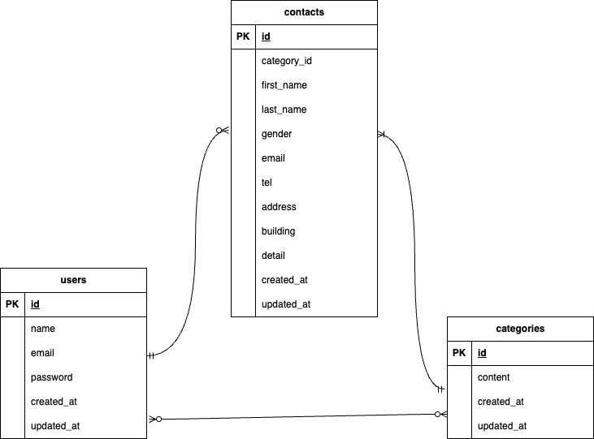

# お問い合わせフォーム

## 環境構築

### Dockerビルド

- docker-compose up -d --build

### Laravel環境構築

- docker-compose exec php bash
- composer install
- .env.exampleファイルから.envを作成し、環境変数を変更
- php artisan key generate
- php artisan migrate
- php artisan db:seed

## 使用技術（実行環境）

- php:7.4.9
- Laravel:8.83.29
- mysql:8.0.26

## ER図

- (test/ER.png)に記載

## URL

- 開発環境:http://localhost/
- phpMyAdmin:http://localhost:8080/

